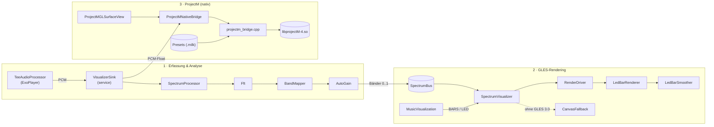
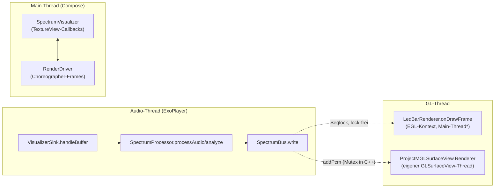

# 1 — Architektur

## Gesamt-Blockschaltbild

Lesart: Es gibt **einen Eingang** (`VisualizerSink` am ExoPlayer) und **zwei
Ausgänge** (GLES-Renderer und ProjectM). Die GLES-Engines lesen aufbereitete
Bänder aus dem `SpectrumBus`; ProjectM bekommt Roh-PCM und macht alles selbst.

## Paket-Übersicht (Zuständigkeiten)

| Paket | Inhalt | Darf kennen |
|---|---|---|
| `service` | `VisualizerSink` — einziger Einstiegspunkt, verteilt PCM an beide Pfade | `audio`, `bus`, `projectm` |
| `audio` | `SpectrumProcessor`, `Fft`, `BandMapper`, `AutoGain` — reine Signalverarbeitung, **kein Android**, JVM-testbar | nur `bus`, `Constants` |
| `bus` | `SpectrumBus` — Thread-Brücke, **kein Android**, JVM-testbar | nur `Constants` |
| `ui` | `SpectrumVisualizer`, `RenderDriver`, `CanvasFallbackVisualizer` — Compose-Hülle + Frame-Steuerung | `bus`, `render`, `audio` (nur Typ `SpectrumProcessor`) |
| `component` | `MusicVisualization` (Engine-Weiche), `ProjectMGLSurfaceView` (GL-Hülle) | `ui`, `projectm` |
| `render` | `LedBarRenderer`, `LedBarSmoother`, `EglManager`, `GlUtil`, `shaders.*` — OpenGL-Zeichnung + Glättung | `bus` |
| `projectm` | `ProjectMNativeBridge`, `PresetManager` — JNI-Fassade + Asset-Verwaltung | nichts (nur Android-SDK) |
| `debug` | `SyntheticSpectrumSource` — künstliche Test-Signale ohne Audio | `bus` |
| Wurzel | `VisualizerConfig`, `VisualizerTheme`, `Constants` — reine Daten/Konstanten | nichts |

Regel: `audio` und `bus` enthalten **keine Android-Imports** — deshalb laufen
ihre Unit-Tests auf der JVM. Alles mit `android.opengl`, `GLSurfaceView` oder
`TextureView` liegt in `ui`/`render`/`component` und ist nur auf Gerät/Emulator
lauffähig.

## Thread-Modell

\* Hinweis: Der GLES-Pfad nutzt bewusst **keinen** `GLSurfaceView`-Thread.
`EglManager` erzeugt den EGL-Kontext auf dem Main-Thread, und `RenderDriver`
triggert Frames per `Choreographer` ebenfalls dort — Surface-Callbacks und
Frames „treffen sich" auf demselben Thread. Nur ProjectM (echte
`GLSurfaceView`) besitzt einen separaten GL-Thread; dort schützt ein
C++-`std::mutex` die native Instanz.

Synchronisations-Prinzipien:

- **GLES-Pfad:** komplett lock-frei (`SpectrumBus` mit Seqlock, atomare
  `enabled`-Flags, `@Volatile isIdle`). Der Audio-Thread blockiert nie.
- **ProjectM-Pfad:** `ProjectMNativeBridge.addPcm` ist ein reiner
  Vorwärts-Kanal (Feuer-und-Vergessen, wirft nie); Lesen/Schreiben der nativen
  Instanz serialisiert `g_mutex` in C++.
- **Lebenszyklus:** `ON_PAUSE`/`Surface-Destroy` stoppen Analyse + Frames, damit
  CPU/GPU auf ~0 % fallen (Details in Kapitel 4).

Weiter: [02 — Audio-Pipeline](02-audio-pipeline.md).
