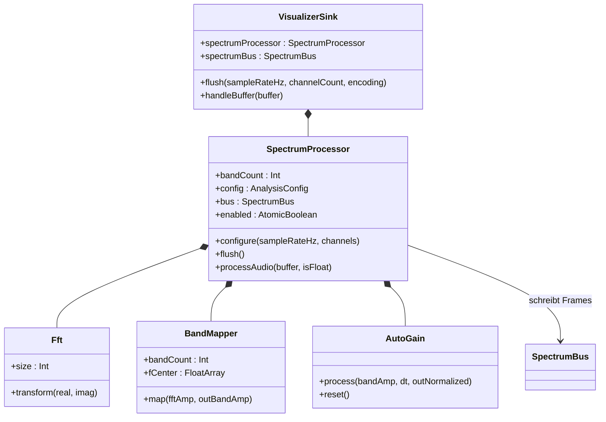
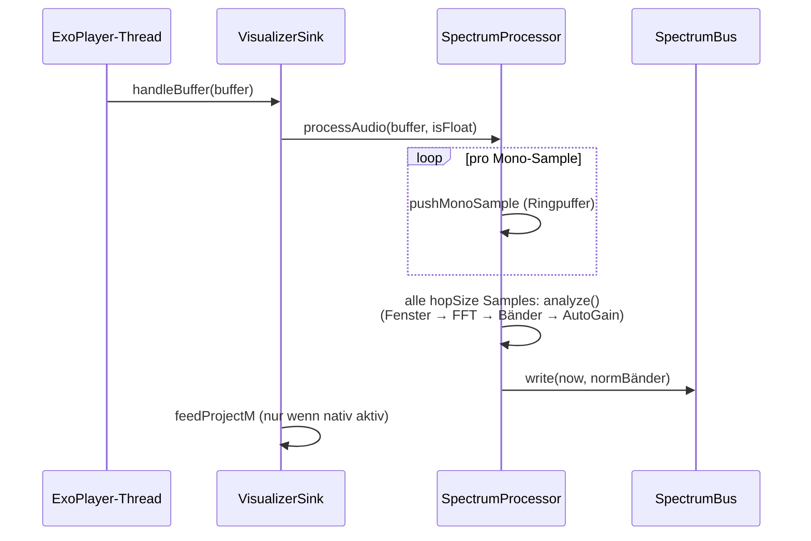

# 2 — Audio-Pipeline (`service`, `audio`)

Die Audio-Pipeline verwandelt rohe PCM-Samples aus ExoPlayer in **normalisierte
Spektralbänder (0.0–1.0)**. Sie läuft vollständig auf dem Audio-Thread,
allokiert im heißen Pfad nichts (kein GC-Jitter) und ist komplett JVM-testbar.

## 2.1 `VisualizerSink` (`service/VisualizerSink.kt`)

**Aufgabe:** Einziger Einstiegspunkt. ExoPlayer ruft ihn pro Audio-Buffer auf;
er verteilt die Daten an **beide** Visualisierungspfade.

- Besitzt einen `SpectrumProcessor` (legt ihn selbst an) und reicht dessen
  `bus` nach außen (`spectrumBus`) — die App verdrahtet Bus + Prozessor in
  `MusicVisualization`/`SpectrumVisualizer`.
- `flush(sampleRateHz, channelCount, encoding)`: wird bei Formatwechsel/Seek
  aufgerufen; reicht Sample-Rate/Kanäle an den Prozessor weiter und setzt dessen
  Puffer zurück (verhindert Geister-Balken nach Seek).
- `handleBuffer(buffer)`:
  1. Unterstützte Encodings (`PCM_FLOAT`, `PCM_16BIT`, `PCM_16BIT_BIG_ENDIAN`)
     → `spectrumProcessor.processAudio(...)`. Andere Encodings (z. B.
     durchgereichtes/offgeloadetes Audio) lassen das Display bewusst leer.
  2. `feedProjectM(...)`: kopiert max. `1024 × Kanäle` Samples als Float
     (−1..1) an `ProjectMNativeBridge.addPcm` — aber nur, wenn nativ aktiv
     (`isActive`), und **niemals werfend** (try/catch: Visualisierung darf
     Playback nie kaputtmachen). Der Eingabe-`ByteBuffer` wird nur
     `duplicate()`-gelesen, nie konsumiert.

## 2.2 `SpectrumProcessor` (`audio/SpectrumProcessor.kt`)

**Aufgabe:** Dirigent der Analyse. Sammelt Mono-Samples im Ringpuffer und stößt
alle `hopSize`-Samples (Standard: 512) eine Analyse an.

Ablauf pro Analyse (`analyze()`):

1. **Fenstern:** letzte `fftSize`-Samples (Standard: 2048) in Zeitreihenfolge
   kopieren, mit **Hann-Fenster** multiplizieren (reduziert Spektral-Leckage an
   den Fensterkanten). Das Fenster und seine Normierungssumme werden einmalig
   vorberechnet (`recomputeWindow()`).
2. **FFT:** `fft.transform(...)` in-place (siehe 2.3).
3. **Amplituden:** Betrag pro Bin, normiert auf die Fenstersumme; DC- und
   Nyquist-Bin einfach, Rest ×2 (Energieerhaltung des reellen Spektrums).
4. **Band-Mapping:** `bandMapper.map(...)` (siehe 2.4).
5. **Auto-Gain:** `autoGain.process(...)` mit Zeit-Delta (geclampt, siehe 2.5).
6. **Publish:** `bus.write(now, normalizedBuffer, bandCount)`.

Details:

- **Downmix:** Mehrkanal-Eingang wird pro Frame gemittelt (Mono). 16-Bit wird
  durch 32768 geteilt, Float direkt übernommen. `ByteBuffer` wird als
  `LITTLE_ENDIAN`-Duplikat gelesen.
- **Ringpuffer:** `pcmRingBuffer` der Größe `fftSize` mit Schreibposition;
  `analyze()` liest „ab Schreibposition" = ältestes Sample zuerst.
- **Rekonfiguration:** `configure()` baut `BandMapper`/`AutoGain` bei
  Sample-Rate-Wechsel neu (Bänder hängen von der Sample-Rate ab).
- **Allokationsfreiheit:** alle Zwischenpuffer (`fftReal`, `fftImag`,
  `fftAmp`, `bandAmpBuffer`, `normalizedBuffer`) sind Felder fester Größe.

## 2.3 `Fft` (`audio/Fft.kt`)

**Aufgabe:** Radix-2-Cooley-Tukey-FFT, in-place, ohne Allokation im heißen Pfad.

- Konstruktor verlangt Zweierpotenz (`require`), Standard via Config: 2048.
- Beim Anlegen werden zwei Tabellen vorberechnet: **Bit-Reversal-Permutation**
  und **Twiddle-Faktoren** (komplexe Drehfaktoren). Dadurch besteht
  `transform(real, imag)` nur noch aus Array-Zugriffen und Arithmetik.
- Getestet in `FftTest` (Impuls → flaches Spektrum, Sinus → Peak am
  erwarteten Bin).

## 2.4 `BandMapper` (`audio/BandMapper.kt`)

**Aufgabe:** Fasst lineare FFT-Bins zu **logarithmischen** Bändern zusammen
(Musik empfindet Tonhöhe logarithmisch — lineare Bins würden Bässe
vernachlässigen).

- Bandkanten: geometrische Folge von `fMinHz` (40 Hz) bis `effectiveFMax`
  (`min(16000 Hz, 0,45 × Sample-Rate)` — Sicherheitsabstand zur
  Nyquist-Frequenz, wo Anti-Aliasing-Filter abrollen). Bandmitte =
  geometrisches Mittel (`sqrt(f0·f1)`), als `fCenter` für den AutoGain-Tilt
  offengelegt.
- **Breite Bänder** (mehrere Bins): RMS-Energiemittel
  (`sqrt(Σa²/n)`) — entspricht wahrgenommener Lautheit besser als das
  arithmetische Mittel.
- **Schmale Bass-Bänder** (kein ganzes Bin): lineare Interpolation zwischen den
  zwei Nachbar-Bins an der fraktionalen Bin-Position.
- Alle Tabellen (Bin-Grenzen, Interpolationsgewichte) werden im Konstruktor
  vorberechnet → `map()` ist schleifenrein und allokationsfrei.

## 2.5 `AutoGain` (`audio/AutoGain.kt`)

**Aufgabe:** Macht aus linearen Band-Amplituden stabile **0.0–1.0-Werte**, die
bei leisen und lauten Tracks gleichermaßen lebendig wirken — ohne in Pausen das
Rauschen hochzuziehen.

Drei Schritte in `process(bandAmp, dt, outNormalized)`:

1. **dB + Tilt:** `20·log10(max(amp, 1e-6))` plus **+3 dB/Oktave-Tilt** ab
   1 kHz (`TILT_REFERENCE_HZ`). Kompensiert, dass Musik/Rauschen zu hohen
   Frequenzen physikalisch abfällt (Höhen wären sonst immer dunkel).
2. **Adaptiver Gain:** Ein `trackDb`-Spitzenfolger merkt sich den lautesten
   Frame (fällt mit `agReleaseDbPerSec` = 2 dB/s ab). Verstärkung =
   `Ziel (−6 dB) − trackDb`, begrenzt auf `agMaxGainDb` (18 dB), nie negativ.
   Unter `DIGITAL_SILENCE_THRESHOLD_DB` (−80 dB) gilt **digitale Stille**:
   kein Boost, Referenzniveau wird zurückgesetzt.
3. **Normierung:** `(dB + Gain − floor(−54 dB)) / (top(−6 dB) − floor)`,
   geclampt auf 0..1.

`reset()` (bei Seek/Flush) setzt den Spitzenfolger auf das Zielniveau zurück.

## Typische Einstiegspunkte für Neue

- Balken zu träge/zu nervös → `AnalysisConfig` (`fftSize`, `hopSize`) in
  `VisualizerConfig.kt`, Glättung in `SmootherConfig` (Kapitel 4).
- Höhen zu dunkel / Bässe zu dominant → `tiltDbPerOctave`, `floorDb`/`topDb`.
- Leise Tracks zu flach → `agMaxGainDb`, `agReleaseDbPerSec`.
- Verfärbungen nach Seek → `flush()`-Kette (`VisualizerSink` →
  `SpectrumProcessor` → `bus.write` Null-Frame).

Weiter: [03 — SpectrumBus](03-spectrum-bus.md).
