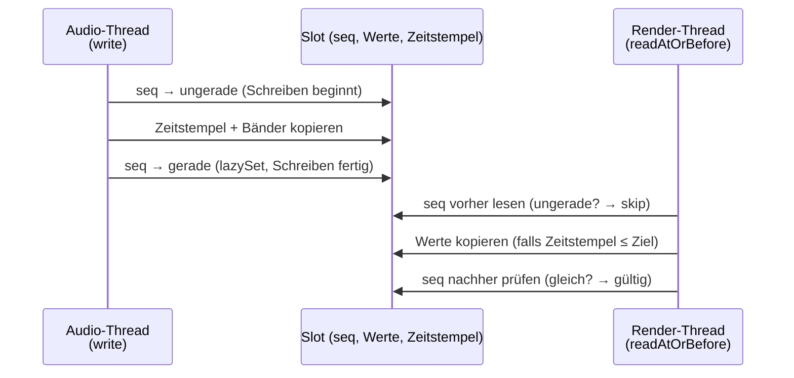

# 3 — SpectrumBus (`bus/SpectrumBus.kt`)

**Aufgabe:** Lock-freier Transport normalisierter Spektral-Frames vom
Audio-Thread (Produzent) zum Render-Thread (Konsument). Entkoppelt beide
Taktraten: Analyse läuft mit ~86 Hz (alle 512 Samples bei 44,1 kHz), Rendering
mit Display-Rate (60/120 Hz).

## Bauform: SPSC-Ringbuffer mit Seqlocks

- `capacity` Slots (Standard: 64 ≈ 740 ms Puffer), jeder Slot fasst bis zu
  `maxBands` (64) Float-Werte plus Zeitstempel und aktive Bandzahl.
- **SPSC** (Single Producer, Single Consumer): genau ein Schreiber
  (`SpectrumProcessor`), ein Leser (`LedBarRenderer` auf dem Render-Thread).
  Dadurch genügen Sequenzzähler statt Locks.
- **Seqlock-Protokoll** pro Slot (`slot.seq: AtomicInteger`):
  - Schreiben: Sequenz auf ungerade setzen → Daten schreiben →
    per `lazySet` auf gerade erhöhen → `writeIndex` erhöhen.
  - Lesen: Sequenz vorher lesen (ungerade = „wird gerade geschrieben" →
    überspringen) → Daten kopieren → Sequenz nachher vergleichen (ungleich =
    währenddessen überschrieben → verwerfen).

## Lese-Semantik: `readAtOrBefore(targetNanos, outValues)`

Der Renderer will nicht „den neuesten", sondern „den zum
Darstellungszeitpunkt gehörenden" Frame:

- `targetNanos = now − visualLatencyMs` (Standard: 150 ms). Die Latenz
  kompensiert Audio-Pipeline + Display-Verzögerung, damit Bild und Ton
  synchron wirken.
- Suche rückwärts ab dem neuesten Slot nach dem jüngsten Frame mit
  `timestamp ≤ target`. Maximal `capacity` Schritte.
- Rückgabe: kopierte Bandzahl, oder **0** (nichts Brauchbares: noch nie
  geschrieben, Ziel-Array zu klein, oder alle Slots inkonsistent).
- `newestTimestampNanos()` erlaubt dem Renderer zusätzlich eine
  **Stale-Erkennung**: Ist der neueste Frame älter als
  `Latenz + STALE_FRAME_GRACE_NANOS` (120 ms), gilt die Quelle als versiegt
  (Pause, Puffern, Track-Ende) → Balken fahren auf null (statt einzufrieren).

## Warum so und nicht einfacher?

- Kein `synchronized`/Mutex auf dem Audio-Pfad: Der Audio-Thread darf nie auf
  den Renderer warten (Dropouts wären hörbar).
- Keine `ConcurrentLinkedQueue` o. ä.: feste Slot-Arrays, `System.arraycopy`
  in aufrufergestellte Puffer → **null Allokationen** pro Frame.
- Kein „neuestes Frame gewinnt": Bei 120-Hz-Displays würde sonst jedes zweite
  Bild denselben Frame zeigen bzw. das Bild dem Ton vorauseilen; die
  Latenzkompensation glättet das.

## Fallstricke

- `writeIndex` ist monoton (`AtomicLong`); Slot-Index = `idx % capacity`.
  Alte Frames werden still überschrieben — Leser müssen mit „0 Bänder"
  umgehen (tun sie: → Zielwerte nullen).
- `bandCount` wird pro Frame mitgeschrieben und auf `maxBands` geclampt; der
  Leser prüft `outValues.size < count → 0`.
- Für Previews/Tests lässt sich der Bus von Hand befüllen (`write(...)`) —
  siehe `MusicVisualizationPreview` und `SpectrumBusTest`.

Weiter: [04 — GLES-Rendering](04-rendering-gles.md).
