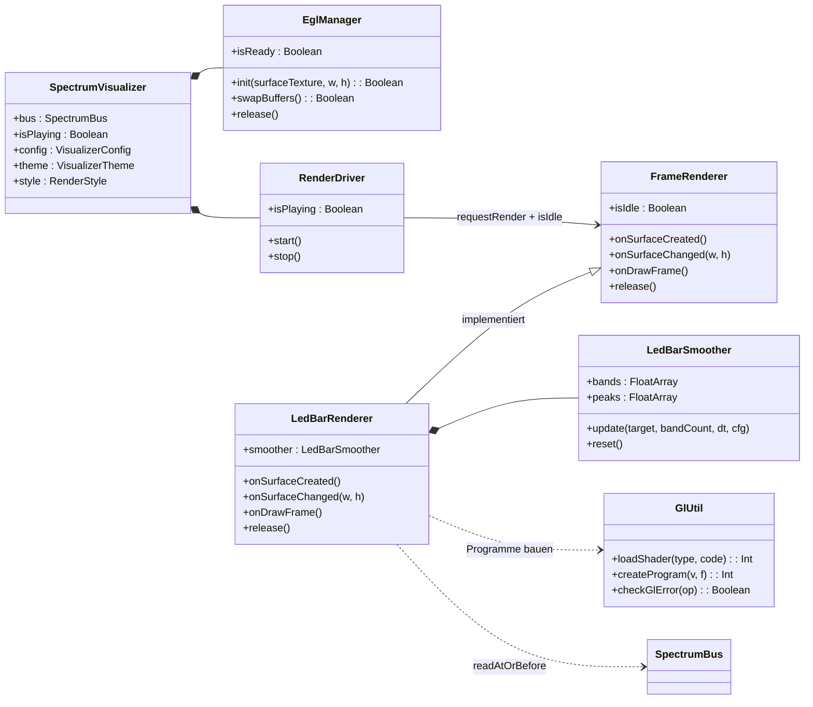
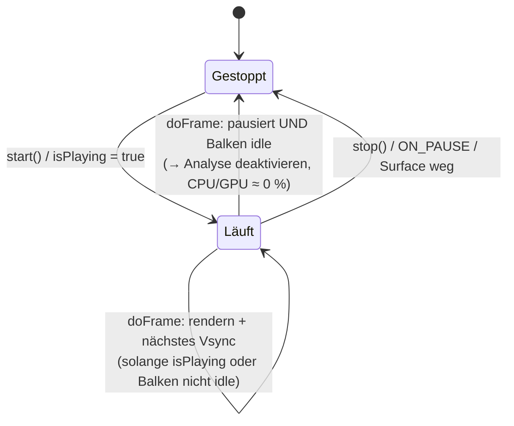

# 4 — GLES-Rendering (`ui`, `render`)

Der GLES-Pfad zeichnet beide 2D-Engines (`BARS`, `LED_SPECTRUM`) als
**Fullscreen-Shader**: ein einziges Dreieck füllt den Bildschirm, die gesamte
LED-Optik entsteht pro Pixel im Fragment-Shader. Kein Mesh, kein VBO, zwei
`glDrawArrays`-Aufrufe pro Frame (einer je nach Stil).

## 4.1 `SpectrumVisualizer` (`ui/SpectrumVisualizer.kt`)

**Aufgabe:** Compose-Hülle, die einen `TextureView` hostet und bei fehlendem
GLES 3.0 nahtlos auf den Canvas-Fallback umschaltet.

- **Warum `TextureView` statt `GLSurfaceView`?** `TextureView` wird *im*
  App-Fenster composited: Transparenz zeigt die App-UI darunter, Compose-Clipping
  und -Alpha greifen. (`ProjectMGLSurfaceView` nutzt dagegen `GLSurfaceView`
  mit eigenem Fenster/Thread.)
- Ablauf: `checkGlEs3Support()` (via `ActivityManager.deviceConfigurationInfo`)
  → `LedBarRenderer` + `EglManager` per `remember` → `AndroidView(TextureView)`
  mit `SurfaceTextureListener`: `init` → `renderer.onSurfaceCreated/Changed` →
  `RenderDriver` anlegen. EGL-Fehlschlag (`init == false`) → `glFailed = true`
  → **Fallback-Composable** (siehe 4.6).
- `update`-Block spiegelt `isPlaying` in den Driver; `onRelease` und
  `onSurfaceTextureDestroyed` stoppen Driver und geben GL-Ressourcen frei.
- **Lifecycle:** `ON_PAUSE` → Analyse aus (`processor.enabled = false`) +
  Frames stoppen; `ON_RESUME` → bei `isPlaying` wieder starten.

## 4.2 `EglManager` (`render/EglManager.kt`)

**Aufgabe:** Minimaler EGL14-Kontext-Manager für genau eine `TextureView`.

- `init()`: Display holen → initialisieren → RGBA8888-ES3-Config wählen →
  ES-3.0-Kontext erzeugen → Window-Surface auf der `SurfaceTexture` erzeugen →
  `eglMakeCurrent`. Jeder Fehlschlag loggt eine Warnung und hinterlässt
  sauberen Release-Zustand (Rückgabe `false` → Fallback).
- `swapBuffers()` stellt den Frame dar; `release()` zerstört Surface, Kontext
  und Display-Verbindung (mehrfach aufrufbar).
- **Thread-Regel:** alle Methoden auf demselben Thread (praktisch Main:
  Surface-Callbacks und Choreographer laufen dort).

## 4.3 `RenderDriver` (`ui/RenderDriver.kt`)

**Aufgabe:** Frame-Schrittmacher per `Choreographer` (Display-Vsync) mit
**Auto-Stop bei Stille**. Hängt nur vom `FrameRenderer`-Interface ab
(`requestRender` + `isIdle`), nicht vom konkreten `LedBarRenderer` — dadurch
für künftige Renderer wiederverwendbar.

- `doFrame`: rendert, solange gespielt wird **oder** Balken/Peaks noch nicht
  auf null abgeklungen sind (`!renderer.isIdle`) — so „fährt" die Anzeige beim
  Pausieren weich herunter statt einzufrieren. Danach: Loop beenden **und**
  `processor.enabled = false` (Analyse aus → kein Akku-Verbrauch).
- `isPlaying = true` startet automatisch neu und reaktiviert die Analyse.

## 4.4 `LedBarRenderer` (`render/LedBarRenderer.kt`)

**Aufgabe:** Liest Bus-Frames, glättet sie, lädt Uniforms, zeichnet.
Einzige `FrameRenderer`-Implementierung (`render/FrameRenderer.kt`: `isIdle`,
`onSurfaceCreated/Changed`, `onDrawFrame`, `release`) — sie bedient beide
Stile (`RenderStyle.LED` und `MIRRORED_BARS`) in einer Klasse.

`onDrawFrame()` in fünf Schritten:

1. **Zeit:** `dt` clampen (`MIN_FRAME_DT_SEC`…`MAX_RENDER_DT_SEC`), Render-Uhr
   für Shimmer weiterzählen.
2. **Lesen:** `bus.readAtOrBefore(now − Latenz)`; bei 0 Bändern oder stale
   → Ziele nullen.
3. **Glätten:** `smoother.update(...)` (siehe 4.5).
4. **Idle prüfen:** max(Bänder, Peaks) < `RENDERER_IDLE_VALUE_THRESHOLD`
   (0,01) **und** keine frischen Daten → `isIdle = true` (Driver stoppt dann).
5. **Zeichnen (Stil-Weiche):**
   - `MIRRORED_BARS` (+ gültiges `barsProgram`) → `drawMirroredBars()`
   - sonst → `drawLed()` (fällt auch bei defektem Bars-Programm darauf zurück)

Beide Draw-Pfade: Framebuffer 0 binden, Viewport setzen, Clear, **Blending an**
(`SRC_ALPHA, ONE_MINUS_SRC_ALPHA` — nicht-premultiplied, passend zur
transparenten Surface), Uniforms laden (Auflösung, Bandwerte als
**vec4-gepackte Arrays** — 16×vec4 = 64 Bänder, passend zu `MAX_SPECTRUM_BANDS`
—, Farben, Geometrie), `glDrawArrays(TRIANGLES, 0, 3)` (Fullscreen-Dreieck),
Blending aus.

**Halo (Neon-Look):** Beide Draw-Pfade addieren um lit Segmente einen äußeren
Schein (`uGlow`, Standard `DEFAULT_GLOW_STRENGTH` = 0,8): exponentieller
Falloff mit der SDF-Distanz (Radius `GLOW_FALLOFF_RADIUS_PX` = 8 px, geteilt
via `ShaderSnippets`). Das Halo ist zonenfarben mit 1-px-Weißsaum an
der Blockkante; lit Blöcke werden nur minimal pegelabhängig heiß (LED:
max. 0,12-Mix, BARS: Amplituden-Weiß-Mix) — die Zonenfarben bleiben
dominant. Das Halo erweitert die Coverage über den Block hinaus, damit der
Schein auf transparenten Surfaces sichtbar bleibt; `uGlow = 0` reproduziert
exakt das frühere Verhalten. Der Canvas-Fallback spiegelt das mit leicht
weißlichem Halo (`HALO_WHITE_MIX`) und pegelabhängig aufgehellten lit
Segmenten (`HOT_CORE_MIX`).

`onSurfaceCreated()` kompiliert **beide** Programme und cached alle
Uniform-Locations; schlägt eines fehl, wird geloggt und der jeweils andere
Stil als Fallback genutzt. `release()` löscht die Programme.

Zusatz: `mirroredBandIndex(column, columnCount, bandCount)` bildet
`columnCount` (Standard 64 = 2×32) per Center-Mirror auf Bänder ab — Bass in
der horizontalen Mitte, nach außen steigende Frequenzen (Legacy-Canvas-Reihenfolge).

## 4.5 `LedBarSmoother` (`render/LedBarSmoother.kt`)

**Aufgabe:** Natürliche Balken-Physik — rein, deterministisch, JVM-testbar
(`LedBarSmootherTest`).

Pro Band und Frame (`update`, `dt` geclampt):

1. **Balken:** sofortiger Anstieg bei lauterem Ziel (**Attack**), sonst
   linearer Abfall `fallPerSec × dt` (Standard 1,6/s), nie unter Ziel.
2. **Peak-Marker:** neuer Peak = Balken + Hold-Timer (`holdSec` = 0,35 s);
   nach Ablauf fällt der Peak mit `peakFallPerSec` (0,5/s) auf den Balken.
3. Inaktive Bänder jenseits `bandCount` werden genullt.

## 4.6 Shader (`render/shaders/*`)

| Objekt | Rolle |
|---|---|
| `FullscreenVertex` | Vertex-Shader: erzeugt aus `gl_VertexID` ein Fullscreen-Dreieck (kein VBO nötig) |
| `ShaderSnippets.ROUNDED_BOX_SDF` | Geteiltes GLSL-Snippet: Signed-Distance-Feld für abgerundete LED-Rechtecke im Pixelraum, ~1,5-px-Antialiasing via `smoothstep`. (GLES hat kein `#include` — Teilen passiert auf Kotlin-Ebene per String-Template.) |
| `LedFragment` | LED-Türme: pro Pixel Band (`uBands`) + Peak (`uPeaks`) aus vec4-Arrays lesen (`band >> 2`, `band & 3`), Segment an/aus, Peak-Segment, drei Farbzonen (`uZoneStart` = 0,60/0,85), aus-LEDs mit `uOffIntensity` dimmen, Alpha = LED-Abdeckung (Transparenz bleibt erhalten) |
| `BarsFragment` | Gespiegelte Balken: Spalte horizontal mittenspiegeln (Bass = Mitte), vertikal an der Bildmitte falten (wächst beidseitig), Farbverlauf Basis→Ziel (`barsThemeFrom`), amplitudenabhängiger Weiß-Glow (max. 0,35), zeitbasierter Shimmer nur auf lit LEDs, Tip-Highlight auf äußerstem lit Segment. **Achtung:** `half` ist in GLSL ES 3.00 reserviert und darf nie als Bezeichner verwendet werden (`ShaderReservedWordsTest` sichert das ab) |

Tuning-Knöpfe: `VisualizerConfig.ledHalfSize` (LED-Größe als Zellanteil),
`cornerRadius`, `segmentCount`, `shimmerStrength`/`tipGlowStrength`
(0 = Effekt aus; Shimmer wirkt in beiden GLES-Engines auf lit LEDs),
`glowStrength` (Außen-Halo, 0 = aus),
`VisualizerTheme` (Farben, Zonen, `offIntensity`).

## 4.7 `CanvasFallbackVisualizer` (`ui/CanvasFallbackVisualizer.kt`)

**Aufgabe:** Pixelgleiche LED-Optik in reinem Compose-`Canvas` für Geräte ohne
GLES 3.0 oder nach EGL-Fehlschlag (gleicher `LedBarSmoother`, gleiche Zonen-
und Peak-Logik mit `PEAK_VISIBILITY_THRESHOLD`).

- Eigene `withFrameNanos`-Schleife statt Choreographer; liest denselben Bus
  mit derselben Latenz; füllt bei Pause/leerem Bus Nullen.
- Zeichnet pro Band × Segment ein `drawRoundRect` (Eckenradius aus
  `cornerRadius`, Größe aus `ledHalfSize`); an = Zonenfarbe, aus = gedimmt
  (`offIntensity`). Lit Segmente bekommen zusätzlich ein Halo
  (expandiertes, schwach-alpha RoundedRect, skaliert mit `glowStrength`).
- Dient gleichzeitig als **Preview-Renderer** (`MusicVisualizationPreview`
  befüllt einen Bus per Hand und zeigt ihn via Fallback — ohne GL-Kontext).

Weiter: [05 — ProjectM / Nativ](05-projectm-nativ.md).
