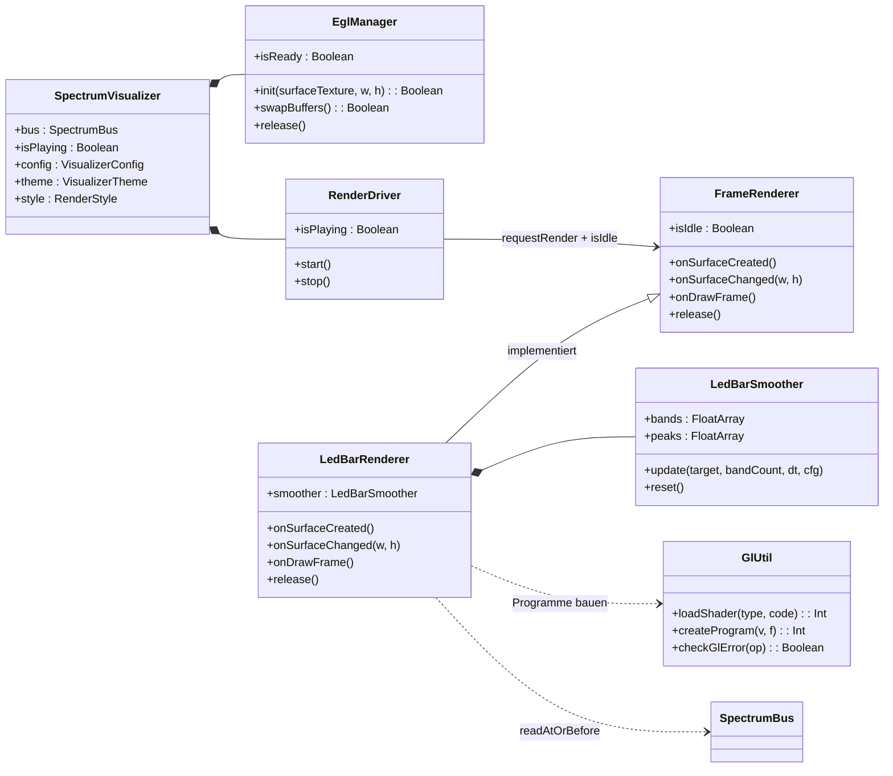
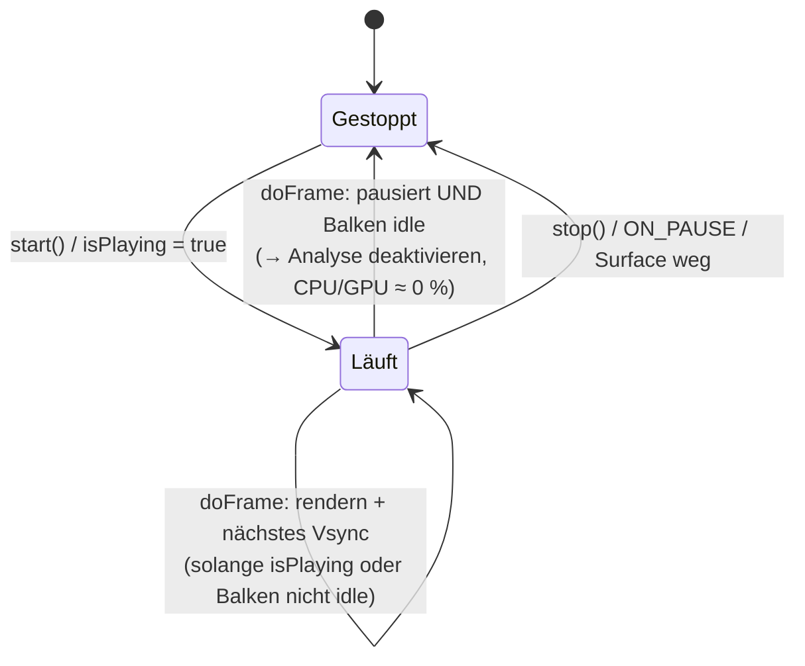

# 4 — GLES-Rendering (`ui`, `render`)

Der GLES-Pfad zeichnet beide 2D-Engines (`BARS`, `LED_SPECTRUM`) als
**Fullscreen-Shader**: ein einziges Dreieck füllt den Bildschirm, die gesamte
LED-Optik entsteht pro Pixel im Fragment-Shader. Kein Mesh, kein VBO, zwei
`glDrawArrays`-Aufrufe pro Frame (einer je nach Stil).

## 4.1 `SpectrumVisualizer` (`ui/SpectrumVisualizer.kt`)

**Aufgabe:** Compose-Hülle, die einen `TextureView` mit GLES-3.0-Spektrum-Engines
hostet. Es gibt bewusst **keinen Canvas-Fallback**: ohne funktionierenden
EGL-Kontext rendert das Composable eine leere `Box` (unsichtbar, nie
abstürzend). Bei `minSdk 36` ist GLES 3.0 faktisch universell; ein separater
Laufzeit-Check wäre toter Code — ein EGL-Fehlschlag (`init == false`) führt
direkt in den leeren Zustand.

- **Warum `TextureView` statt `GLSurfaceView`?** `TextureView` wird *im*
  App-Fenster composited: Transparenz zeigt die App-UI darunter, Compose-Clipping
  und -Alpha greifen. (`ProjectMGLSurfaceView` nutzt dagegen `GLSurfaceView`
  mit eigenem Fenster/Thread.)
- Ablauf: `LedBarRenderer` + `EglManager` per `remember` → `AndroidView(TextureView)`
  mit `SurfaceTextureListener`, dessen Callbacks ihre Arbeit auf einen
  **eigenen `VisualizerGL`-HandlerThread** posten: `init` →
  `renderer.onSurfaceCreated/Changed` → `RenderDriver` dort anlegen (sein
  `Choreographer` bindet sich an den Looper des GL-Threads). EGL-Fehlschlag
  (`init == false`) → `eglFailed = true` (zurück auf Main gepostet) → leere
  `Box`. `renderer.bus/config/theme/style`
  werden per `LaunchedEffect` nachgezogen (kein Renderer-Neubau bei
  Bus-Wechsel); `config/theme/style`-Wechsel markieren nur ein Dirty-Flag,
  das der GL-Thread auswertet (siehe 4.4).
- `update`-Block postet `isPlaying`/`maxFps` an den GL-Thread; `onRelease` und
  `onSurfaceTextureDestroyed` stoppen den Driver, geben GL-Ressourcen **auf dem
  GL-Thread** frei und beenden ihn per `quitSafely` (idempotent, wiederholt
  aufrufbar — z. B. Rotation erzeugt einen neuen Thread).
- **Lifecycle:** `ON_PAUSE` → Analyse aus (`processor.enabled = false`) +
  Frames stoppen (auf GL-Thread gepostet); `ON_RESUME` → bei `isPlaying`
  wieder starten.

## 4.2 `EglManager` (`render/EglManager.kt`)

**Aufgabe:** Minimaler EGL14-Kontext-Manager für genau eine `TextureView`.

- `init()`: Display holen → initialisieren → RGBA8888-ES3-Config wählen →
  ES-3.0-Kontext erzeugen → Window-Surface auf der `SurfaceTexture` erzeugen →
  `eglMakeCurrent`. Jeder Fehlschlag loggt eine Warnung und hinterlässt
  sauberen Release-Zustand (Rückgabe `false` → Fallback).
- `swapBuffers()` stellt den Frame dar; `release()` zerstört Surface, Kontext
  und Display-Verbindung (mehrfach aufrufbar). Fehlschlag (`init == false`) →
  leere `Box` (kein Canvas-Fallback).
- `setBufferSize()` nach View-Resize (die EGL-Window-Surface übernimmt die neue
  Größe beim nächsten Swap).
- **Thread-Regel:** alle Methoden auf demselben Thread — dem `VisualizerGL`-
  Render-Thread. Besitz wird bei `init` festgehalten; Fremd-Thread-Aufrufe
  werden geloggt und ignoriert (statt stillen GL-Fehlern).

## 4.3 `RenderDriver` (`ui/RenderDriver.kt`)

**Aufgabe:** Frame-Schrittmacher per `Choreographer` (Display-Vsync) mit
**Auto-Stop bei Stille** und optionaler **FPS-Drossel** (`maxFps`, z. B. 30 —
halbiert GPU-Last, visuell ausreichend). Hängt nur vom `FrameRenderer`-Interface ab
(`requestRender` + `isIdle`), nicht vom konkreten `LedBarRenderer` — dadurch
für künftige Renderer wiederverwendbar. Muss auf dem Thread erzeugt werden,
dessen Frames er treibt (Choreographer bindet an den Erzeuger-Looper);
`start()`/`stop()` sind synchronisiert und von überall aufrufbar.

- `doFrame`: rendert, solange gespielt wird **oder** Balken/Peaks noch nicht
  auf null abgeklungen sind (`!renderer.isIdle`) — so „fährt" die Anzeige beim
  Pausieren weich herunter statt einzufrieren. Danach: Loop beenden **und**
  `processor.enabled = false` (Analyse aus → kein Akku-Verbrauch). Mit `maxFps`
  werden zu frühe Frames per `postFrameCallbackDelayed` vertagt statt verworfen
  (reine Entscheidungslogik in `shouldRenderAt`/`remainingDelayMillis`,
  JVM-testbar in `RenderDriverThrottleTest`).
- `isPlaying = true` startet automatisch neu und reaktiviert die Analyse.

## 4.4 `LedBarRenderer` (`render/LedBarRenderer.kt`)

**Aufgabe:** Liest Bus-Frames, glättet sie, lädt Uniforms, zeichnet.
Einzige `FrameRenderer`-Implementierung (`render/FrameRenderer.kt`: `isIdle`,
`onSurfaceCreated/Changed`, `onDrawFrame`, `release`) — sie bedient beide
Stile (`RenderStyle.LED` und `MIRRORED_BARS`) in einer Klasse.

`onDrawFrame()` in fünf Schritten:

1. **Zeit:** `dt` clampen (`MIN_FRAME_DT_SEC`…`MAX_RENDER_DT_SEC`), Render-Uhr
   für Shimmer weiterzählen.
2. **Lesen:** `bus.readAtOrBefore(now − Latenz)`; bei 0 Bändern oder stale
   → Ziele nullen.
3. **Glätten:** `smoother.update(...)` (siehe 4.5).
4. **Idle prüfen:** max(Bänder, Peaks) < `RENDERER_IDLE_VALUE_THRESHOLD`
   (0,01) **und** keine frischen Daten → `isIdle = true` (Driver stoppt dann).
5. **Zeichnen (Stil-Weiche):**
   - `MIRRORED_BARS` (+ gültiges `barsProgram`) → `drawMirroredBars()`
   - sonst → `drawLed()` (fällt auch bei defektem Bars-Programm darauf zurück)

Beide Draw-Pfade: Framebuffer 0 binden, Clear, **Blending an**
(`SRC_ALPHA, ONE_MINUS_SRC_ALPHA` — nicht-premultiplied, passend zur
transparenten Surface), **pro Frame nur dynamische Uniforms** (Auflösung,
Band-/Peak-Werte als **vec4-gepackte Arrays** — 16×vec4 = 64 Bänder, passend zu
`MAX_SPECTRUM_BANDS` —, Render-Uhr), `glDrawArrays(TRIANGLES, 0, 3)`
(Fullscreen-Dreieck), Blending aus. Alle rahmenunabhängigen Uniforms
(Band-/Segment-Zahlen, Farben, Zonen, Geometrie, Effektstärken) setzt
`applyStaticUniformsIfNeeded()` **einmalig** nach Programm-Erstellung bzw. bei
`config`-/`theme`-/`style`-Wechsel (Dirty-Flag, vom Host-Thread gesetzt, vom
GL-Thread per volatile Read übernommen).

**LED-Lichtkit (Neon-Look):** Der LED-Pfad ergänzt den äußeren Schein
(`uGlow`, Standard `DEFAULT_GLOW_STRENGTH` = 0,8, exponentieller Falloff mit der
SDF-Distanz, Radius `GLOW_FALLOFF_RADIUS_PX` = 8 px, plus weite Aura mit 3×
Radius) um ein analytisches Lichtkit — alles Hue-agnostisch (Weiß-Mix oder
Zonen-Multiplikation), daher für jedes Theme gleich: weiß-heißer Kern mit
gesättigtem Mittelring (`uHotCore` = 0,85), wandernder Dome-Glanz
(`uSpecular` = 0,25), Lichtaustritt in die Fugen über der Front plus
Säulen-Wash (`uBleed` = 0,8, nur bei Signal), Pegelgradierung von ruhiger
Basis zu heißer Spitze (`uGlowGrade` = 0,65), weiches Frontier-Ausfaden
(`uFade` = 1,0), Trail-Gedächtnis als Afterglow-Ghosts (`uTrail`/`uTrailStrength`
= 0,7 — Blöcke glimmen nacheinander aus), Ambient-Rim auf aus-LEDs.
Das Halo erweitert die Coverage über den Block hinaus, damit der Schein auf
transparenten Surfaces sichtbar bleibt; `uGlow = 0` reproduziert exakt das
Verhalten vor dem Lichtkit. (BARS: Amplituden-Weiß-Mix max. 0,35 — die
Zonenfarben bleiben dominant.)

`onSurfaceCreated()` kompiliert **beide** Programme und cached alle
Uniform-Locations; schlägt eines fehl, wird geloggt und der jeweils andere
Stil als Fallback genutzt. `release()` löscht die Programme.

Zusatz: `mirroredBandIndex(column, columnCount, bandCount)` bildet
`columnCount` (Standard 64 = 2×32) per Center-Mirror auf Bänder ab — Bass in
der horizontalen Mitte, nach außen steigende Frequenzen (Legacy-Canvas-Reihenfolge).

## 4.5 `LedBarSmoother` (`render/LedBarSmoother.kt`)

**Aufgabe:** Natürliche Balken-Physik — rein, deterministisch, JVM-testbar
(`LedBarSmootherTest`).

Pro Band und Frame (`update`, `dt` geclampt):

1. **Balken:** sofortiger Anstieg bei lauterem Ziel (**Attack**), sonst
   linearer Abfall `fallPerSec × dt` (Standard 1,6/s), nie unter Ziel.
2. **Peak-Marker:** neuer Peak = Balken + Hold-Timer (`holdSec` = 0,35 s);
   nach Ablauf fällt der Peak mit `peakFallPerSec` (0,5/s) auf den Balken.
3. **Trail-Gedächtnis:** folgt dem Balken sofort nach oben, fällt aber nur mit
   `trailFallPerSec` (0,55/s) — hinkt dadurch mehrere Blöcke hinter der live
   Front her und speist die Afterglow-Ghosts (`uTrail`); Invariante
   `trail ≥ bands`, in `LedBarSmootherTest` abgesichert.
4. Inaktive Bänder jenseits `bandCount` werden genullt (Balken, Peaks, Trail, Hold).

`maxValue(bandCount)` (Max über aktive Balken + Peaks + Trail) nutzen Render-Loops für
die Idle-Erkennung — inklusive Trail, damit Loops erst stoppen, wenn auch die
Geister verblasst sind.

## 4.6 Shader (`render/shaders/*`)

| Objekt | Rolle |
|---|---|
| `FullscreenVertex` | Vertex-Shader: erzeugt aus `gl_VertexID` ein Fullscreen-Dreieck (kein VBO nötig) |
| `ShaderSnippets.ROUNDED_BOX_SDF` | Geteiltes GLSL-Snippet: Signed-Distance-Feld für abgerundete LED-Rechtecke im Pixelraum, ~1,5-px-Antialiasing via `smoothstep`. (GLES hat kein `#include` — Teilen passiert auf Kotlin-Ebene per String-Template.) |
| `LedFragment` | LED-Türme: pro Pixel Band (`uBands`) + Peak (`uPeaks`) aus vec4-Arrays lesen (`band >> 2`, `band & 3`), Segment an/aus, Peak-Segment, drei Farbzonen (`uZoneStart` = 0,60/0,85), aus-LEDs mit `uOffIntensity` dimmen, Alpha = LED-Abdeckung (Transparenz bleibt erhalten). Darauf das **LED-Lichtkit** (alles Hue-agnostisch via Weiß-Mix/Zonen-Multiplikation, daher für jedes Theme gleich): weiß-heißer Kern mit gesättigtem Mittelring (`uHotCore`, 0,85), wandernder Dome-Glanz (`uSpecular`, 0,25), Lichtaustritt über der Front plus Säulen-Wash (`uBleed`, 0,8, nur bei Signal), Pegelgradierung (`uGlowGrade`, 0,65), Frontier-Fade (`uFade`, 1,0), Afterglow-Ghosts (`uTrail`, 0,7), enges Halo plus weite Aura (`uGlow`, 0,8), Ambient-Rim auf aus-LEDs |
| `BarsFragment` | Gespiegelte Balken: Spalte horizontal mittenspiegeln (Bass = Mitte), vertikal an der Bildmitte falten (wächst beidseitig), Farbverlauf Basis→Ziel (`barsThemeFrom`), amplitudenabhängiger Weiß-Glow (max. 0,35), zeitbasierter Shimmer nur auf lit LEDs, Tip-Highlight auf äußerstem lit Segment. **Achtung:** `half` ist in GLSL ES 3.00 reserviert und darf nie als Bezeichner verwendet werden (`ShaderReservedWordsTest` sichert das ab) |

Tuning-Knöpfe: `VisualizerConfig.ledHalfSize` (LED-Größe als Zellanteil),
`cornerRadius`, `segmentCount`, `shimmerStrength`/`tipGlowStrength`
(0 = Effekt aus; Shimmer wirkt in beiden GLES-Engines auf lit LEDs),
`glowStrength` (Außen-Halo + Aura, 0 = aus),
`hotCoreStrength`/`specularStrength`/`bleedStrength` (LED-Lichtkit, je 0 = aus;
`uGlow = 0` stellt zusätzlich das Verhalten vor dem Lichtkit exakt wieder her),
`VisualizerTheme` (Farben, Zonen, `offIntensity`).

## 4.7 Previews ohne GL-Kontext

`@Preview` hat keinen GL-Kontext, daher rendert `MusicVisualizationPreview`
einen **statischen Mock** (`StaticBarsPreview` in `MusicVisualization.kt`):
feste Pegel, gleiche Zellgeometrie und Zonenfarben, aber ohne Bus-I/O,
Glättung oder Animation. Der frühere `CanvasFallbackVisualizer` wurde entfernt
(siehe 4.1) — ein animierter Canvas-Nachbau des wachsenden Shader-Umfangs
(Hot-Core, Bleed, Aura) wäre unverhältnismäßig teuer für einen reinen
Notfallpfad.

Weiter: [05 — ProjectM / Nativ](05-projectm-nativ.md).
