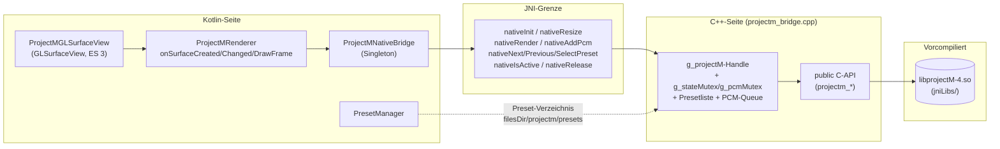

# 5 — ProjectM / Nativ (`component`, `projectm`, `cpp`)

Der ProjectM-Pfad rendert 3D-Milkdrop-Visuals in nativem C++ (`libprojectM`)
auf einer eigenen `GLSurfaceView`. Kotlin besitzt **keine** Rendering-Logik —
es verwaltet nur Lebenszyklus, Presets und PCM-Nachschub.

## 5.1 `ProjectMGLSurfaceView` (`component/ProjectMGLSurfaceView.kt`)

**Aufgabe:** Dünne GL-Hülle mit festem Setup — hält nur den
Application-Context (kein Activity-Leak):

- EGL-Kontext **3.0**, RGBA8888 **ohne Depth/Stencil** (ProjectM zeichnet nur
  texturierte Fullscreen-Quads), `ZOrderMediaOverlay`.
- `presetName`-Property: bei Änderung via `queueEvent` (also auf dem
  GL-Thread!) an `selectPreset` weitergereicht.
- `isPlaying`-Property (von `MusicVisualization` mit Playback verdrahtet):
  Der GL-Thread läuft bewusst auch bei Pause weiter — projectM fährt auf
  verklungenem Audio weich herunter und idelt danach ruhig, statt hart
  einzufrieren. Bei Pause wird nur gestapeltes PCM verworfen (`clearPcm`),
  damit der Auslauf sauber startet; Resume braucht nichts (nichts wurde
  angehalten). Preis: Fullscreen-Rendering bei Pause kostet weiter GPU.
- Preset-Extraktion startet schon im `init` auf einem Hintergrund-Thread
  (`PresetManager.ensurePresetsExtractedAsync`); nach Abschluss wird
  `init(pfad)` per `queueEvent` wiederholt (re-scannt nur das Verzeichnis).
- Innerer `ProjectMRenderer` (ohne Context-Referenz):
  - `onSurfaceCreated` → `PresetManager.presetDirPath()` (**kein Asset-I/O**,
    nur Verzeichnis anlegen) → `ProjectMNativeBridge.recreate(presetDir)` (+
    optionales `selectPreset`). **Immer destroy-then-create:** Eine überlebende
    Instanz gehört zu einem toten EGL-Kontext (stale GL-Handles → `not found in
    VAO state` → SIGSEGV in `glDrawElements`); Surface-Neuanlagen (Rotation,
    Picker-Dialog, Pause/Resume) brauchen daher grundsätzlich eine frische
    Instanz. **Reihenfolge wichtig:** `recreate` braucht einen aktuellen
    GL-Kontext.
  - `onSurfaceChanged` → `resize(w, h)`.
  - `onDrawFrame` → `render()`.
- `onDetachedFromWindow` → `release()` **per `queueEvent`** (GL-Thread-Kontext!),
  dann erst `super.onDetachedFromWindow()`.

## 5.2 `ProjectMNativeBridge` (`projectm/ProjectMNativeBridge.kt`)

**Aufgabe:** Absturzsichere JNI-Fassade als `object`-Singleton.

- **Ladereihenfolge** im `init`: erst `projectM-4`, dann `projectm_bridge`
  (die Bridge linkt gegen die Lib). Schlägt eines fehl
  (`UnsatisfiedLinkError`), werden **alle** Aufrufe zu sicheren No-Ops —
  die GL-Fläche zeigt dann nur die Stub-Hintergrundfarbe, die App läuft weiter.
- Öffentliche Methoden (`init`, `resize`, `render`, `addPcm`, `nextPreset`,
  `previousPreset`, `selectPreset`, `release`, `isActive`) prüfen
  `isNativeLibraryLoaded` und delegieren an `private external fun`
  (`native*`).
- `addPcm(pcmData: FloatArray, channels)`: interleavtes Float-PCM (−1..1,
  LRLR bei Stereo). Nativ wird nur in eine begrenzte Queue eingereiht (älteste
  Samples fallen bei Überlauf raus); der Render-Thread drainiert sie pro Frame.
  `isActive` (= Lib geladen **und** native Instanz existent, **lock-frei** per
  atomarem Flag) steuert, ob `VisualizerSink` überhaupt Samples schickt.

## 5.3 `projectm_bridge.cpp` (`src/main/cpp/`)

**Aufgabe:** Einzige Stelle mit nativem projectM-Kontakt. Nutzt
**ausschließlich die öffentliche C-API** (`projectM-4/projectM.h`,
`projectm_*`-Funktionen) — die C++-Klassen-API hat in der vorcompilierten Lib
*hidden visibility*; jeder Griff darauf endet im Linkfehler
(`undefined symbol`).

Zustand und Lock-Modell (feste Reihenfolge `g_stateMutex` → `g_pcmMutex`, nie umgekehrt):

- `g_stateMutex` schützt `g_projectM` (opakes Handle), `g_presetDir`, sortierte
  `g_presets` + `g_presetIndex`, Viewport-Größe. Wird während
  `projectm_opengl_render_frame` gehalten.
- `g_pcmMutex` schützt nur die begrenzte Pending-PCM-Queue
  (`g_pendingPcm`, max. 16384 Samples — Ältestes fällt bei Überlauf raus).
  `nativeAddPcm` hängt Samples unter diesem kurzen Lock an und berührt die
  Instanz **nie** — der Audio-Thread blockiert dadurch nicht auf Render-Frames.
  `nativeRender` drainiert die Queue (kurzer `pcm`-Lock unter gehaltenem
  `state`-Lock) und füttert die Kopie per `projectm_pcm_add_float` an projectM.
- `g_instanceActive` (`std::atomic<bool>`, in `init` gesetzt, in `release`
  gelöscht) macht `nativeIsActive` **lock-frei** — der Audio-Thread darf es pro
  Buffer abfragen.
- `android_gl_load_proc`: GL-Funktionslader — erst `eglGetProcAddress`, dann
  Fallback per `dlsym` auf `libGLESv3.so`/`libGLESv2.so` (Android liefert
  Core-Funktionen nicht über `eglGetProcAddress`); das Handle wird per
  `call_once` initialisiert.
- `nativeInit`: Preset-Verzeichnis scannen (`.milk`-Suffix, sortiert) →  GL-Info loggen → Log-Callback setzen → `projectm_create_with_opengl_load_proc`
  (muss auf dem GL-Thread mit aktuellem Kontext laufen) → Fenstergröße +
  Textur-Suchpfad setzen → **erstes Preset ohne Übergang** laden
  (Folgewechsel immer mit Übergang = `smooth`).
- `nativeResize`: `glViewport` + `projectm_set_window_size`.
- `nativeRender`: `projectm_opengl_render_frame`; ohne Instanz nur
  dunkelblaues Clear (Stub-Modus, z. B. wenn per CMake ohne Prebuilt gebaut).
- `nativeAddPcm`: Float-Array aus JNI holen und unter dem kurzen `pcm`-Lock in
  die Pending-Queue einreihen (per `JNI_ABORT` freigeben, kein Rückkopieren
  nötig). Der Render-Thread übergibt die drainierte Kopie an
  `projectm_pcm_add_float(handle, samples, count, STEREO|MONO)`
  (`count` = Samples **pro Kanal**).
- `nativeNext/Previous/SelectPreset`: Index-Arithmetik (Previous mit
  `+ size − 1` statt Modulo-negativ) bzw. Pfad aus Verzeichnis + Name laden
  und Index nachführen.
- **Erst-Lade-Invariante:** `g_hasPresetLoaded` stellt sicher, dass der erste
  Preset-Load einer Instanz immer hart (`smooth = false`) erfolgt — ein weicher
  Übergang aus dem leeren Idle-Zustand crasht in libprojectM (Null-VAO/Programm
  in `glDrawElements`, SIGSEGV). `selectPreset` prüft per `stat`, ob die Datei
  existiert (sonst: Log + als `g_pendingPreset` merken statt projectM einen
  ungültigen Pfad zu geben); ein Re-`init` nach abgeschlossener Extraktion lädt
  dann das pendiente bzw. erste Preset hart nach. `release` setzt beide Flags
  zurück.
- **Kontext-Guards:** `hasCurrentGlContext()` (`glGetString(GL_VERSION) != null`)
  sichert `init`/`select`/`next`/`previous` gegen kontextlose Aufrufe aus
  Lifecycle-Races (z. B. gequetes `init` vor der ersten Surface): ohne Kontext
  kein Create, kein Shader-Load — nur loggen bzw. als pending merken. Der
  spätere `onSurfaceCreated`-`recreate` heilt den Zustand.
- `nativeIsActive`/`nativeRelease`: Handle-Check bzw. `projectm_destroy` +
  Listen leeren.

## 5.4 `PresetManager` (`projectm/PresetManager.kt`)

**Aufgabe:** Macht gebündelte Presets zur Laufzeit auffindbar.

- `ensurePresetsExtracted(context)`: kopiert `assets/presets/*.milk` nach
  `filesDir/projectm/presets/` — nur fehlende Dateien (idempotent), löscht
  stale `.milk`-Dateien älterer App-Versionen, gibt den absoluten Pfad zurück
  (→ `nativeInit`). Einzelfehler pro Datei brechen weder Copy noch Cleanup ab.
- `presetDir(context)`/`presetDirPath(context)`: nur Verzeichnis anlegen, kein
  Asset-I/O — für den GL-Thread (`onSurfaceCreated`) geeignet.
- `ensurePresetsExtractedAsync(context, onDone)`: gleiche Arbeit auf einem
  geteilten Daemon-Thread (`PresetExtractor`); Callback-Fehler werden geloggt,
  nie geworfen.
- `getAvailablePresets` (sortierte `.milk`-Namen) und `getPresetFilePath`
  für Preset-Auswahl-UIs.
- Mitgeliefert: 8 eigene `Muzzic -*`-Presets in `src/main/assets/presets/`.

## 5.5 Nativ-Build (`CMakeLists.txt`, `jniLibs/`, `build_projectm.sh`)

- `src/main/cpp/CMakeLists.txt`: sucht `libprojectM*.so/.a` unter
  `jniLibs/${ANDROID_ABI}` → als `IMPORTED`-Lib einbinden + `HAVE_PROJECTM=1`
  definieren. **Ohne** Prebuilt wird nur der Stub (`projectm_bridge` ohne
  projectM) gebaut — App bleibt lauffähig, ProjectM zeigt Hintergrundfarbe.
  Gelinkt wird gegen `GLESv2`, `EGL`, `log`.
- `src/main/jniLibs/<arm64-v8a|x86_64|armeabi-v7a|x86>/libprojectM-4.so`:
  vorcompilierte projectM-4.2.0-Binaries (Hauptbuild lädt sie, compiliert aber
  kein C++-Upstream neu → schneller Build).
- `build_projectm.sh` (im `visualization/`-Verzeichnis ausführen): klont
  projectM (master + Submodule), patcht `GladLoader.cpp` auf GLES 3.0
  (Upstream verlangt 3.2) und `VertexArray.hpp` (redundante Binds raus),
  baut pro ABI mit NDK-Toolchain (`ENABLE_GLES=ON`, SDL/QT/Tests aus),
  strippt, kopiert `.so` nach `jniLibs/` sowie öffentliche C-Header
  (`*.h`, **kein** C++-`hpp`) + generierte `version.h`/`projectM_export.h`
  nach `cpp/include/projectM-4/`.

**Die wichtigste Regel dieses Kapitels:** JNI-Bridge **nur** gegen
`projectM-4/projectM.h` (C-API). Wer interne `libprojectM`-C++-Header
vendored oder C++-Symbole aufruft, bekommt `undefined symbol`-Linkfehler —
das ist dokumentiertes Verhalten der Prebuilts, kein Toolchain-Bug.

Weiter: [06 — Konfiguration & UI](06-konfiguration.md).
