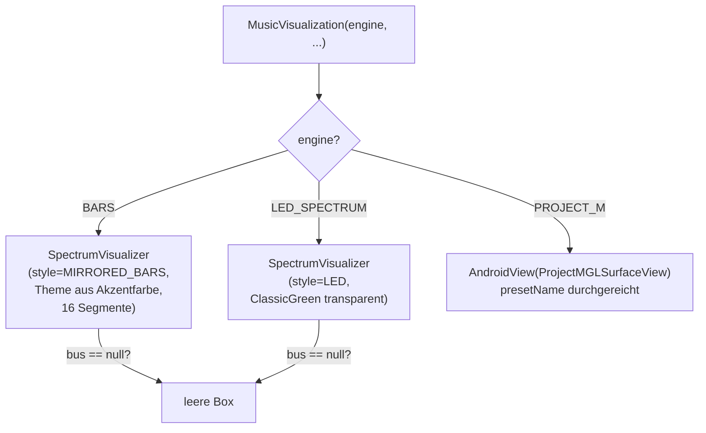

# 6 — Konfiguration & UI-Einstieg

## 6.1 `MusicVisualization` (`component/MusicVisualization.kt`)

**Aufgabe:** Die einzige Composable, die die App kennen muss. Engine-Weiche
mit drei Ästen:

- `BARS` baut Theme (`VisualizerTheme.barsThemeFrom(color)`) und Config
  (16 Segmente, Shimmer/Tip-Glow je nach Flags) per `remember` und reicht
  `spectrumBus` + `spectrumProcessor` durch. Ohne Bus: leere `Box` (kein
  Crash, kein Platzhalter-Flackern).
- `LED_SPECTRUM` nutzt `ClassicGreen` mit **transparentem** Hintergrund —
  die LED-Formen tragen ihr eigenes Alpha, das Host-Layout scheint durch.
- `PROJECT_M` bettet die `GLSurfaceView` per `AndroidView` ein; `update`
  reicht Preset-Wechsel nach.
- `MusicVisualizationPreview` zeigt beide Modi (hell/dunkel): befüllt einen
  `SpectrumBus` per Hand mit 8 Beispielwerten, **rückdatiert** um
  `PREVIEW_SYNTH_FRAME_AGE_NANOS` (damit der Frame im Latenzfenster liegt) und
  rendert über den GL-freien Canvas-Fallback — Previews brauchen keinen
  Emulator.

## 6.2 `VisualizerConfig` / `AnalysisConfig` / `SmootherConfig` (`VisualizerConfig.kt`)

Reine Datenklassen (Defaults = Standard-Look):

- `VisualizerConfig`: `bandCount` (32), `columnCount` (64, nur BARS),
  `segmentCount` (16 BARS / 20 LED), `ledHalfSize` (0,40 × 0,34 als
  Zellanteil), `cornerRadius` (0,25), `visualLatencyMs` (150),
  `maxFps` (null = Display-Rate), dazu `analysis` + `smoother`.
- `AnalysisConfig`: `fftSize` 2048, `hopSize` 512, `fMinHz` 40,
  `fMaxHz` 16000 (effektiv `min(fMax, 0,45 × Sample-Rate)`),
  dB-Skala `floorDb` −54 → `topDb` −6, Tilt +3 dB/Oktave,
  Auto-Gain (`agTargetTopDb` −6, `agMaxGainDb` 18, `agReleaseDbPerSec` 2,0).
- `SmootherConfig`: `fallPerSec` 1,6, `holdSec` 0,35, `peakFallPerSec` 0,5.

Tuning-Leitfaden: trägere Balken → `hopSize`/`fallPerSec`; Höhen dunkel →
`tiltDbPerOctave`; leise Tracks flach → `agMaxGainDb`; Bild eilt Ton voraus →
`visualLatencyMs`.

## 6.3 `VisualizerTheme` (`VisualizerTheme.kt`)

**Aufgabe:** Farben + Zonen, getrennt von Geometrie (Config).

- Felder: `colLow`/`colMid`/`colHigh`, `zoneStart` (Gelb ab 0,60, Rot ab 0,85),
  `background`, `offIntensity` (Dimmung aus-LEDs, 0,06; BARS nutzt 0 = unsichtbar).
- Presets: `ClassicGreen`, `Amber`, `IceBlue`.
- `barsThemeFrom(base)`: leitet aus einer Material-Akzentfarbe einen Verlauf
  ab — Basisfarbe in der Mitte, um `VISUALIZER_HUE_COLOR_DEGREE` (40°)
  gedrehte Zielfarbe außen. Eigene **reine Kotlin**-HSL-Konvertierung
  (bewusst ohne `ColorUtils`, damit JVM-Tests laufen — siehe `BarsThemeTest`).

## 6.4 `Constants.kt`

Zentrale Konstanten statt Magic Numbers: Band-Limits (8/32/64), Geometrie
(64 Spalten, 16/20 Segmente), Zeit (`NANOS_PER_*`, dt-Clamps, 120-ms-Stale-Grace,
Idle-Schwelle 0,01, Peak-Sichtbarkeit 0,02), Audio-Referenzen (44100 Hz
Fallback, 16-Bit-Peak 32768, Tilt-Referenz 1 kHz, dB-Faktor 20, Nyquist-Marge
0,45, Silence −80 dB), Theme-Zonen, GLES-3.0-Versionscode, Debug-Werte.
Wer einen Schwellenwert sucht, schaut **hier zuerst**.

## 6.5 `SyntheticSpectrumSource` (`debug/SyntheticSpectrumSource.kt`)

**Aufgabe:** Künstliche Spektral-Frames ohne Audiowiedergabe — für visuelles
Tuning, Screenshots und manuelle Tests.

- Modi: `SWEEP` (wandernder Peak), `PINK` (rauschen mit 1/√f-Abfall),
  `BEAT` (Bass-Puls + Rausch-Rest), `SILENCE`, `FULL_SCALE`.
- Schreibt per Scheduler mit ~86 Hz (`SYNTH_FRAME_INTERVAL_MICROS` = 11,6 ms —
  gleiche Rate wie die echte Analyse) direkt in einen `SpectrumBus`.
- Nur Debug-Werkzeug, kein Produktionspfad (`start()`/`stop()` explizit).

Weiter: [07 — Build & Test](07-build-test.md).
